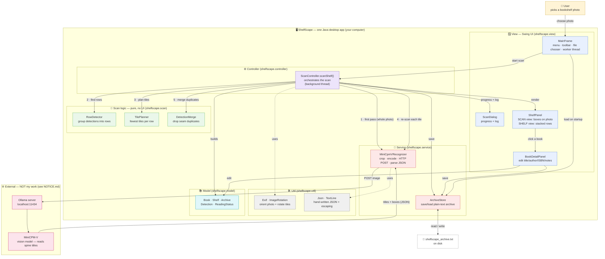
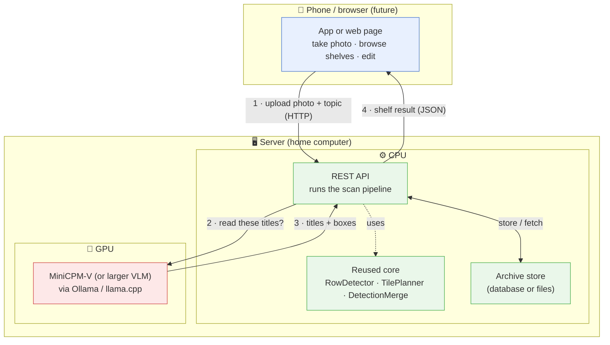

# ShelfScape — Architecture

## Today: one Java desktop app + a local AI model

Everything runs on your computer. ShelfScape is a single Java (Swing) program;
the only external piece is the **MiniCPM-V** vision model, served by **Ollama**
(a separate program — not my work, see [`NOTICE.md`](../NOTICE.md)).

### How one scan flows (the numbered arrows)

1. **First pass** — the whole photo is sent to the model once, to find roughly
   where the books are.
2. **Find rows** — `RowDetector` groups those detections into shelf rows by
   vertical position.
3. **Plan tiles** — `TilePlanner` decides the *fewest* horizontal tiles each row
   needs so small spine text is big enough for the model to read.
4. **Re-scan tiles** — each tile is cropped, rotated upright, sent to the model;
   its boxes are mapped back onto the original photo.
5. **Merge** — `DetectionMerge` removes books that were seen twice on overlapping
   tile seams. The result becomes a `Shelf` of `Book`s, rendered and saved.

> Note: steps 2, 3, 5 are **pure logic** with no UI or image classes that bind
> them to the desktop — that's deliberate, so they can be reused on a server (see
> below).

---

## Future target: phone front-end + server

The long-term goal is a phone app. Swing can't run on a phone, but the green
`shelfscape.scan` core (and the model/recognizer idea) carries straight over —
only the UI and the image plumbing get swapped.

The bridge from "today" to "future" is to pull the scan orchestration out of
`MainFrame` into a headless service that a small HTTP server can call — the
desktop UI and a phone UI then both talk to the same core.
